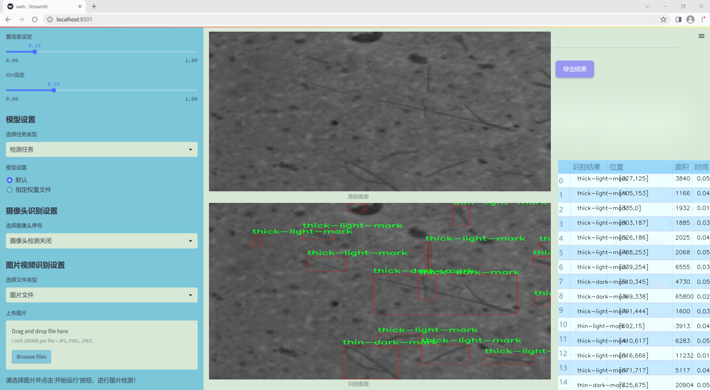
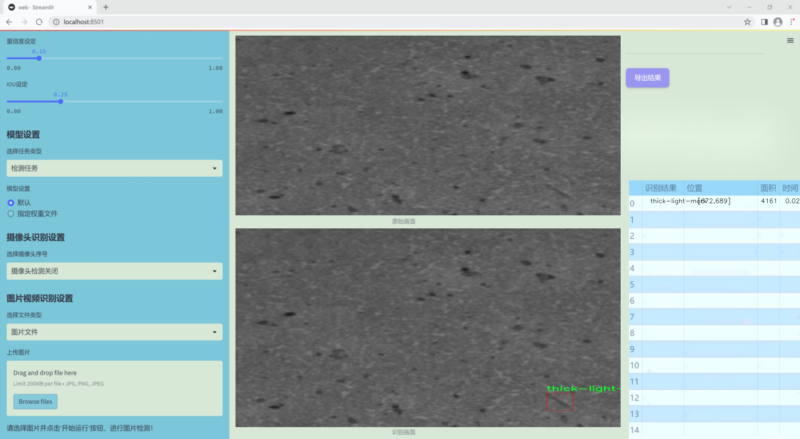
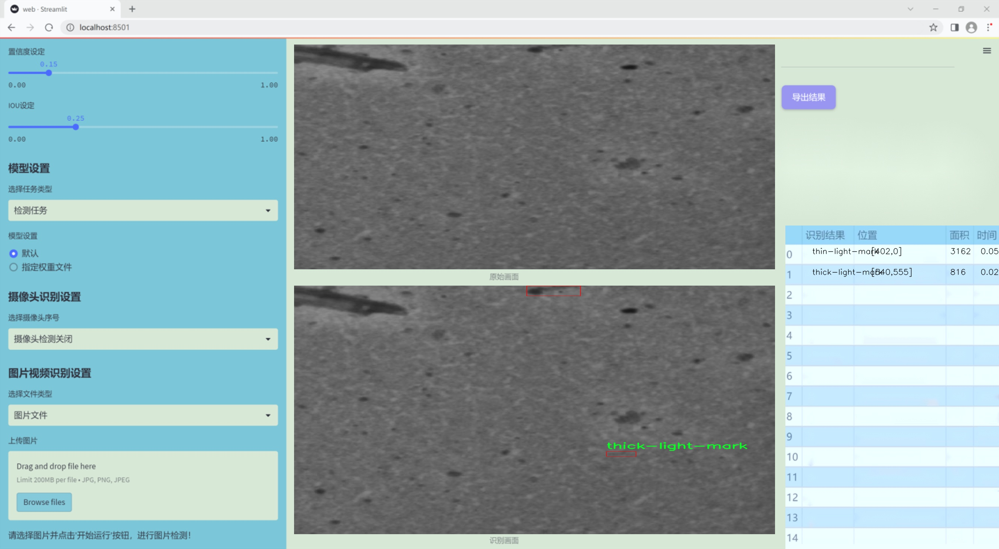
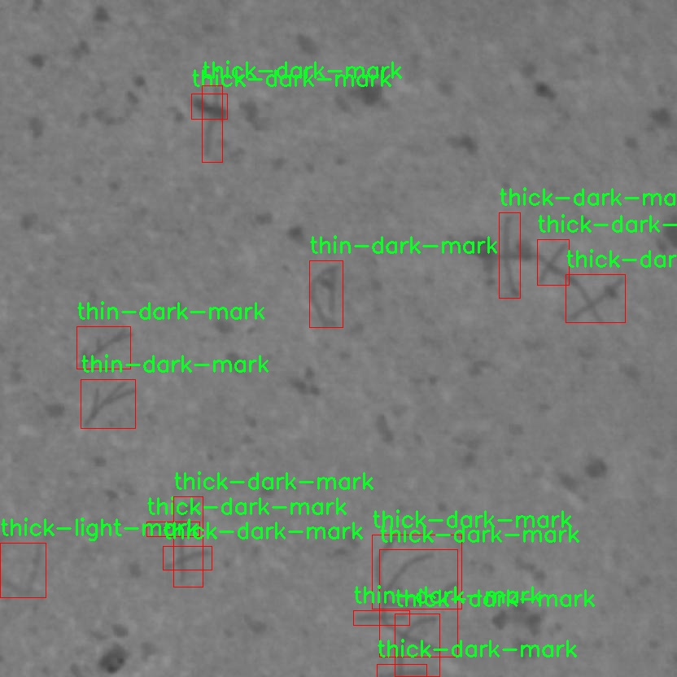
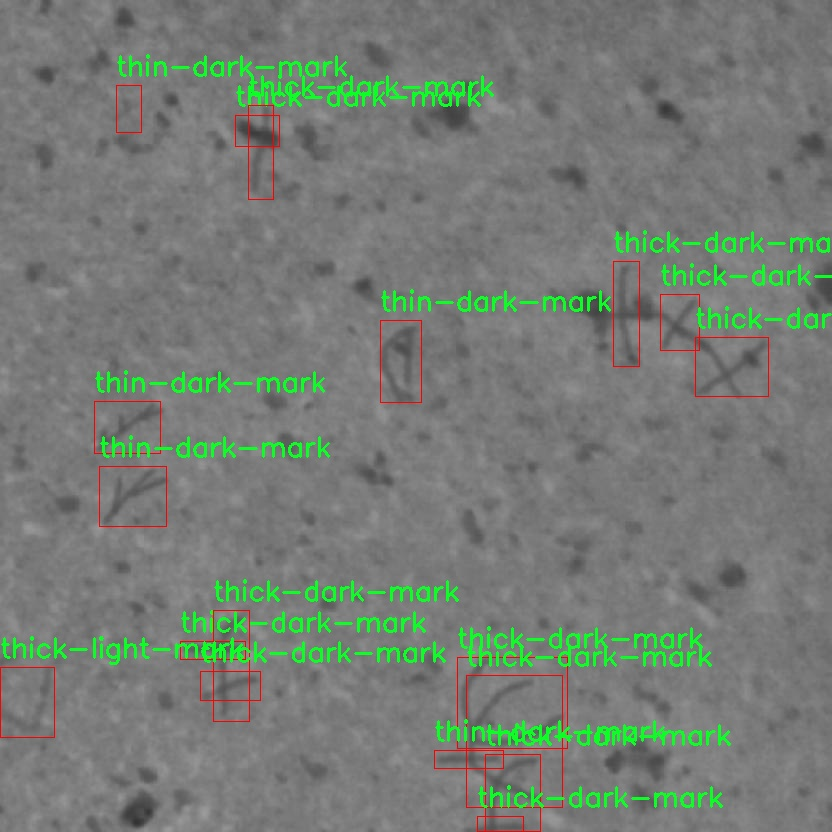
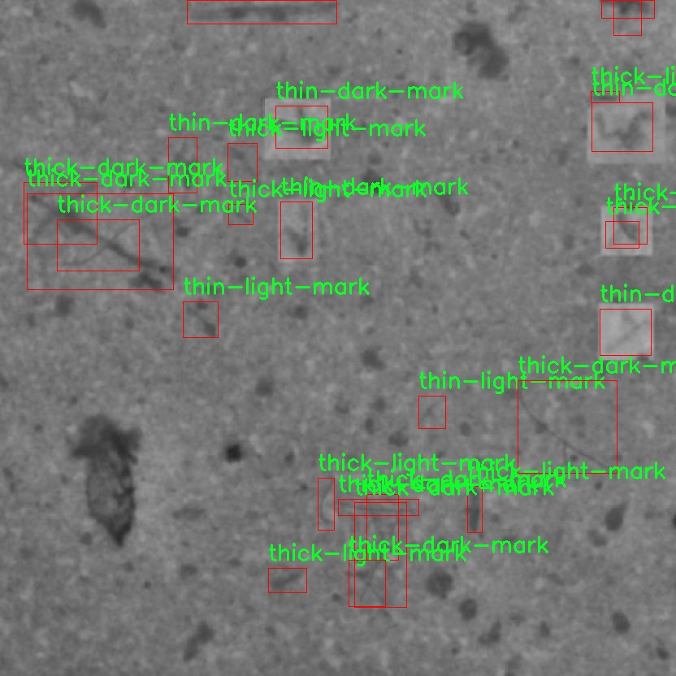
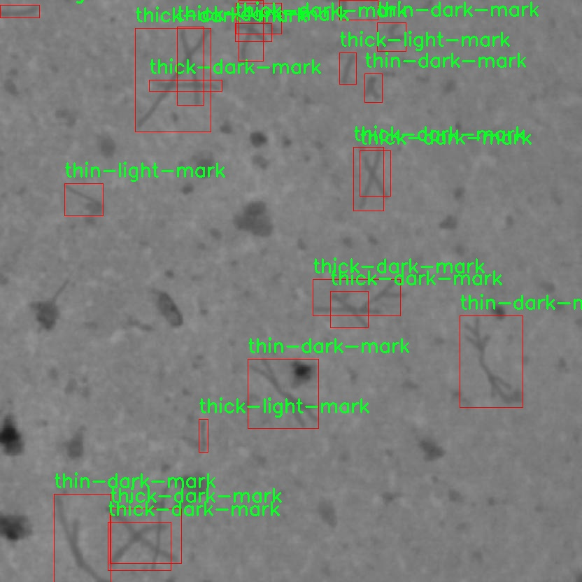
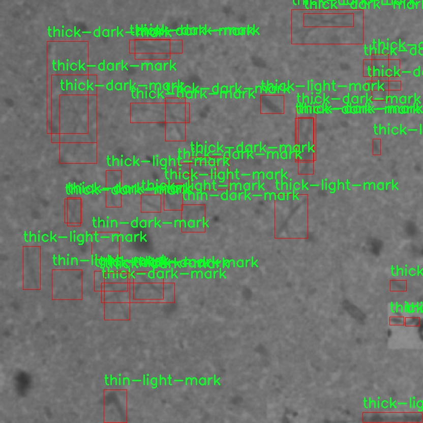

# 改进yolo11-CA-HSFPN等200+全套创新点大全：石棉检测系统源码＆数据集全套

### 1.图片效果展示







##### 项目来源 **[人工智能促进会 2024.10.22](https://kdocs.cn/l/cszuIiCKVNis)**

##### 注意：由于项目一直在更新迭代，上面“1.图片效果展示”和“2.视频效果展示”展示的系统图片或者视频可能为老版本，新版本在老版本的基础上升级如下：（实际效果以升级的新版本为准）

  （1）适配了YOLOV11的“目标检测”模型和“实例分割”模型，通过加载相应的权重（.pt）文件即可自适应加载模型。

  （2）支持“图片识别”、“视频识别”、“摄像头实时识别”三种识别模式。

  （3）支持“图片识别”、“视频识别”、“摄像头实时识别”三种识别结果保存导出，解决手动导出（容易卡顿出现爆内存）存在的问题，识别完自动保存结果并导出到tempDir中。

  （4）支持Web前端系统中的标题、背景图等自定义修改。

  另外本项目提供训练的数据集和训练教程,暂不提供权重文件（best.pt）,需要您按照教程进行训练后实现图片演示和Web前端界面演示的效果。

### 2.视频效果展示

[2.1 视频效果展示](https://www.bilibili.com/video/BV1gPyZYaEPP/)

### 3.背景

研究背景与意义

随着工业化进程的加快，石棉作为一种广泛应用于建筑和制造业的材料，其潜在的健康风险逐渐引起了社会的广泛关注。石棉纤维的吸入与多种严重疾病，如肺癌、石棉肺和间皮瘤等密切相关。因此，开发高效、准确的石棉检测系统，成为了保障公共健康和环境安全的重要任务。传统的石棉检测方法通常依赖于人工取样和显微镜分析，不仅耗时耗力，而且易受人为因素的影响，导致检测结果的准确性和可靠性降低。

近年来，计算机视觉和深度学习技术的迅猛发展为石棉检测提供了新的解决方案。YOLO（You Only Look Once）系列模型因其高效的实时目标检测能力，逐渐成为该领域的研究热点。尤其是YOLOv5和YOLOv11等改进版本，凭借其更优的检测精度和速度，能够在复杂环境中实现对石棉的快速识别。然而，现有的YOLO模型在特定应用场景下仍存在一些不足之处，如对不同类型石棉的区分能力不足、对小目标的检测精度不高等。

本研究旨在基于改进的YOLOv11模型，构建一个高效的石棉检测系统。通过利用包含1300张图像的专用数据集，该数据集涵盖了厚暗标记、厚亮标记、薄暗标记和薄亮标记四种类别，系统将能够更全面地识别和分类不同类型的石棉。这一系统的建立不仅能够提高石棉检测的效率和准确性，还将为相关行业提供科学依据，推动石棉安全管理的规范化与标准化，进而保护公众健康和环境安全。通过这一研究，我们期望为石棉检测领域的技术进步贡献一份力量，同时为后续的相关研究提供基础数据和方法论支持。

### 4.数据集信息展示

##### 4.1 本项目数据集详细数据（类别数＆类别名）

nc: 4
names: ['thick-dark-mark', 'thick-light-mark', 'thin-dark-mark', 'thin-light-mark']


该项目为【目标检测】数据集，请在【训练教程和Web端加载模型教程（第三步）】这一步的时候按照【目标检测】部分的教程来训练

##### 4.2 本项目数据集信息介绍

本项目数据集信息介绍

本项目所使用的数据集名为“asbestos”，旨在为改进YOLOv11的石棉检测系统提供高质量的训练数据。该数据集包含四个类别，分别为“thick-dark-mark”、“thick-light-mark”、“thin-dark-mark”和“thin-light-mark”。这些类别的划分是基于石棉材料在不同条件下的视觉特征，反映了石棉的不同形态和状态。通过对这些特征的准确识别，模型能够更有效地检测和分类石棉，从而提升其在实际应用中的性能。

在数据集的构建过程中，研究团队收集了大量的石棉样本图像，确保每个类别的样本数量均衡且多样化。这些图像经过精心标注，确保每个类别的特征都能被清晰地识别。为了提高模型的泛化能力，数据集中还包含了不同光照、角度和背景下的样本，模拟了真实环境中可能遇到的各种情况。这种多样性不仅增强了模型的鲁棒性，也为其在实际应用中的推广奠定了基础。

此外，数据集的设计考虑到了石棉检测的实际需求，旨在提高检测的准确性和效率。通过使用YOLOv11这一先进的目标检测算法，结合“asbestos”数据集的丰富信息，研究团队期望能够显著提升石棉检测系统的性能，为环境保护和公共安全提供有力支持。总之，本项目的数据集为石棉检测的研究与应用提供了坚实的基础，推动了相关领域的技术进步。











### 5.全套项目环境部署视频教程（零基础手把手教学）

[5.1 所需软件PyCharm和Anaconda安装教程（第一步）](https://www.bilibili.com/video/BV1BoC1YCEKi/?spm_id_from=333.999.0.0&vd_source=bc9aec86d164b67a7004b996143742dc)


[5.2 安装Python虚拟环境创建和依赖库安装视频教程（第二步）](https://www.bilibili.com/video/BV1ZoC1YCEBw?spm_id_from=333.788.videopod.sections&vd_source=bc9aec86d164b67a7004b996143742dc)

### 6.改进YOLOv11训练教程和Web_UI前端加载模型教程（零基础手把手教学）

[6.1 改进YOLOv11训练教程和Web_UI前端加载模型教程（第三步）](https://www.bilibili.com/video/BV1BoC1YCEhR?spm_id_from=333.788.videopod.sections&vd_source=bc9aec86d164b67a7004b996143742dc)


按照上面的训练视频教程链接加载项目提供的数据集，运行train.py即可开始训练



     Epoch   gpu_mem       box       obj       cls    labels  img_size
     1/200     20.8G   0.01576   0.01955  0.007536        22      1280: 100%|██████████| 849/849 [14:42<00:00,  1.04s/it]
               Class     Images     Labels          P          R     mAP@.5 mAP@.5:.95: 100%|██████████| 213/213 [01:14<00:00,  2.87it/s]
                 all       3395      17314      0.994      0.957      0.0957      0.0843

     Epoch   gpu_mem       box       obj       cls    labels  img_size
     2/200     20.8G   0.01578   0.01923  0.007006        22      1280: 100%|██████████| 849/849 [14:44<00:00,  1.04s/it]
               Class     Images     Labels          P          R     mAP@.5 mAP@.5:.95: 100%|██████████| 213/213 [01:12<00:00,  2.95it/s]
                 all       3395      17314      0.996      0.956      0.0957      0.0845

     Epoch   gpu_mem       box       obj       cls    labels  img_size
     3/200     20.8G   0.01561    0.0191  0.006895        27      1280: 100%|██████████| 849/849 [10:56<00:00,  1.29it/s]
               Class     Images     Labels          P          R     mAP@.5 mAP@.5:.95: 100%|███████   | 187/213 [00:52<00:00,  4.04it/s]
                 all       3395      17314      0.996      0.957      0.0957      0.0845


###### [项目数据集下载链接](https://kdocs.cn/l/cszuIiCKVNis)

### 7.原始YOLOv11算法讲解


2024年9月30日，Ultralytics在其活动YOLOVision中正式发布了YOLOv 11。YOLOv
11是由位于美国和西班牙的Ultralytics团队开发的YOLO的最新版本。YOLO是一种用于基于图像的人工智能的计算机模型。


YOLOv11与其他版本的YOLO相比的性能

##### YOLOv11改进方向

与YOLOv10相比，YOLOv11有了巨大的改进，包括但不限于：

  * 增强的模型结构：模型具有改进的模型结构，以获取图像处理并形成预测

  * GPU优化：这是现代ML模型的反映，GPU训练ML模型在速度和准确性上都更好。

  * 速度：YOLOv 11模型现在经过增强和GPU优化以用于训练。通过优化，这些模型比它们的前版本快得多。在速度上达到了25%的延迟减少！

  * 更少的参数：更少的参数允许更快的模型，但v11的准确性不受影响

  * 更具适应性：更多支持的任务YOLOv 11支持多种类型的任务、多种类型的对象和多种类型的图像。

##### YOLOv11功能介绍

Glenn Jocher和他的团队制作了一个令人敬畏的YOLOv 11迭代，并且在图像人工智能的各个方面都提供了YOLO。YOLOv 11有多种型号，包括：

  * 对象检测-在训练时检测图像中的对象

  * 图像分割-超越对象检测，分割出图像中的对象

  * 姿态检测-当用点和线训练时绘制一个人的姿势

  * 定向检测（OBB）：类似于对象检测，但包围盒可以旋转

  * 图像分类-在训练时对图像进行分类

使用Ultralytics Library，这些模型还可以进行优化，以：

  * 跟踪-可以跟踪对象的路径

  * 易于导出-库可以以不同的格式和目的导出

  * 多场景-您可以针对不同的对象和图像训练模型

此外，Ultralytics还推出了YOLOv 11的企业模型，该模型将于10月31日发布。这将与开源的YOLOv
11模型并行，但将拥有更大的专有Ultralytics数据集。YOLOv 11是“建立在过去的成功”的其他版本的之上。

##### YOLOv11模型介绍

YOLOv 11附带了边界框模型（无后缀），实例分割（-seg），姿态估计（-pose），定向边界框（-obb）和分类（-cls）。

这些也有不同的尺寸：纳米（n），小（s），中（m），大（l），超大（x）。


YOLOv11模型

##### YOLOv11与前版本对比

与YOLOv10和YOLOv8相比，YOLOv11在Ultralytics的任何帖子中都没有直接提到。所以我会收集所有的数据来比较它们。感谢Ultralytics：

**检测：**


YOLOv11检测统计


YOLOv10检测统计

其中，Nano的mAPval在v11上为39.5，v10上为38.5；Small为47.0 vs 46.3，Medium为51.5 vs
51.1，Large为53.4 vs 53.2，Extra Large为54.7vs
54.4。现在，这可能看起来像是一种增量增加，但小小数的增加可能会对ML模型产生很大影响。总体而言，YOLOv11以0.3
mAPval的优势追平或击败YOLOv10。

现在，我们必须看看速度。在延迟方面，Nano在v11上为1.55 , v10上为1.84，Small为2.46 v2.49，Medium为4.70
v4.74，Large为6.16 v7.28，Extra Large为11.31
v10.70。延迟越低越好。YOLOv11提供了一个非常低的延迟相比，除了特大做得相当差的前身。

总的来说，Nano模型是令人振奋的，速度更快，性能相当。Extra Large在性能上有很好的提升，但它的延迟非常糟糕。

**分割：**


YOLOV11 分割统计


YOLOV9 分割统计


YOLOV8 分割数据

总体而言，YOLOv 11上的分割模型在大型和超大型模型方面比上一代YOLOv 8和YOLOv 9做得更好。

YOLOv 9 Segmentation没有提供任何关于延迟的统计数据。比较YOLOv 11延迟和YOLOv 8延迟，发现YOLOv 11比YOLOv
8快得多。YOLOv 11将大量GPU集成到他们的模型中，因此期望他们的模型甚至比CPU测试的基准更快！

**姿态估计：**


YOLOV11姿态估计统计


YOLOV8姿态估计统计

YOLOv 11的mAP 50 -95统计量也逐渐优于先前的YOLOv 8（除大型外）。然而，在速度方面，YOLOv
11姿势可以最大限度地减少延迟。其中一些延迟指标是版本的1/4！通过对这些模型进行GPU训练优化，我可以看到指标比显示的要好得多。

**定向边界框：**


YOLOv11 OBB统计


YOLOv8 OBB统计

OBB统计数据在mAP
50上并不是很好，只有非常小的改进，在某种程度上小于检测中的微小改进。然而，从v8到v11的速度减半，这表明YOLOv11在速度上做了很多努力。

**最后，分类：**


YOLOv 11 CLS统计


YOLOv8 CLS统计

从v8到v11，准确性也有了微小的提高。然而，速度大幅上升，CPU速度更快的型号。


### 8.200+种全套改进YOLOV11创新点原理讲解

#### 8.1 200+种全套改进YOLOV11创新点原理讲解大全

由于篇幅限制，每个创新点的具体原理讲解就不全部展开，具体见下列网址中的改进模块对应项目的技术原理博客网址【Blog】（创新点均为模块化搭建，原理适配YOLOv5~YOLOv11等各种版本）

[改进模块技术原理博客【Blog】网址链接](https://gitee.com/qunmasj/good)


#### 8.2 精选部分改进YOLOV11创新点原理讲解

###### 这里节选部分改进创新点展开原理讲解(完整的改进原理见上图和[改进模块技术原理博客链接](https://gitee.com/qunmasj/good)【如果此小节的图加载失败可以通过CSDN或者Github搜索该博客的标题访问原始博客，原始博客图片显示正常】



### 视觉transformer(ViT)简介
视觉transformer(ViT)最近在各种计算机视觉任务中证明了巨大的成功，并受到了相当多的关注。与卷积神经网络(CNNs)相比，ViT具有更强的全局信息捕获能力和远程交互能力，表现出优于CNNs的准确性，特别是在扩大训练数据大小和模型大小时[An image is worth 16x16 words: Transformers for image recognition at scale,Coatnet]。

尽管ViT在低分辨率和高计算领域取得了巨大成功，但在高分辨率和低计算场景下，ViT仍不如cnn。例如，下图(左)比较了COCO数据集上当前基于cnn和基于vit的一级检测器。基于vit的检测器(160G mac)和基于cnn的检测器(6G mac)之间的效率差距超过一个数量级。这阻碍了在边缘设备的实时高分辨率视觉应用程序上部署ViT。


左图:现有的基于vit的一级检测器在实时目标检测方面仍然不如当前基于cnn的一级检测器，需要的计算量多出一个数量级。本文引入了第一个基于vit的实时对象检测器来弥补这一差距。在COCO上，efficientvit的AP比efficientdet高3.8，而mac较低。与YoloX相比，efficient ViT节省67.2%的计算成本，同时提供更高的AP。

中:随着输入分辨率的增加，计算成本呈二次增长，无法有效处理高分辨率的视觉应用。

右图:高分辨率对图像分割很重要。当输入分辨率从1024x2048降低到512x1024时，MobileNetV2的mIoU减少12% (8.5 mIoU)。在不提高分辨率的情况下，只提高模型尺寸是无法缩小性能差距的。

ViT的根本计算瓶颈是softmax注意模块，其计算成本随输入分辨率的增加呈二次增长。例如，如上图(中)所示，随着输入分辨率的增加，vit- small[Pytorch image models. https://github.com/rwightman/ pytorch-image-models]的计算成本迅速显著大于ResNet-152的计算成本。

解决这个问题的一个直接方法是降低输入分辨率。然而，高分辨率的视觉识别在许多现实世界的计算机视觉应用中是必不可少的，如自动驾驶，医疗图像处理等。当输入分辨率降低时，图像中的小物体和精细细节会消失，导致目标检测和语义分割性能显著下降。

上图(右)显示了在cityscape数据集上不同输入分辨率和宽度乘法器下MobileNetV2的性能。例如，将输入分辨率从1024x2048降低到512x1024会使cityscape的性能降低12% (8.5 mIoU)。即使是3.6倍高的mac，只放大模型尺寸而不增加分辨率也无法弥补这一性能损失。

除了降低分辨率外，另一种代表性的方法是限制softmax注意，方法是将其范围限制在固定大小的局部窗口内[Swin transformer,Swin transformer v2]或降低键/值张量的维数[Pyramid vision transformer,Segformer]。然而，它损害了ViT的非局部注意能力，降低了全局接受域(ViT最重要的优点)，使得ViT与大内核cnn的区别更小[A convnet for the 2020s,Scaling up your kernels to 31x31: Revisiting large kernel design in cnns,Lite pose: Efficient architecture design for 2d human pose estimation]。

本文介绍了一个有效的ViT体系结构，以解决这些挑战。发现没有必要坚持softmax注意力。本文建议用线性注意[Transformers are rnns: Fast autoregressive transformers with linear attention]代替softmax注意。

线性注意的关键好处是，它保持了完整的n 2 n^2n 2
 注意映射，就像softmax注意。同时，它利用矩阵乘法的联想特性，避免显式计算完整的注意映射，同时保持相同的功能。因此，它保持了softmax注意力的全局特征提取能力，且计算复杂度仅为线性。线性注意的另一个关键优点是它避免了softmax，这使得它在移动设备上更有效(下图左)。


左图:线性注意比类似mac下的softmax注意快3.3-4.5倍，这是因为去掉了硬件效率不高的softmax功能。延迟是在Qualcomm Snapdragon 855 CPU和TensorFlow-Lite上测量的。本文增加线性注意的头部数量，以确保它具有与softmax注意相似的mac。

中:然而，如果没有softmax注意中使用的非线性注意评分归一化，线性注意无法有效集中其注意分布，削弱了其局部特征提取能力。后文提供了可视化。

右图:本文用深度卷积增强线性注意，以解决线性注意的局限性。深度卷积可以有效地捕捉局部特征，而线性注意可以专注于捕捉全局信息。增强的线性注意在保持线性注意的效率和简单性的同时，表现出在各种视觉任务上的强大表现(图4)。

然而，直接应用线性注意也有缺点。以往的研究表明线性注意和softmax注意之间存在显著的性能差距(下图中间)。


左:高通骁龙855上的精度和延迟权衡。效率vit比效率网快3倍，精度更高。中:ImageNet上softmax注意与线性注意的比较。在相同的计算条件下，本文观察到softmax注意与线性注意之间存在显著的精度差距。而深度卷积增强模型后，线性注意的精度有明显提高。

相比之下，softmax注意的精度变化不大。在相同MAC约束下，增强线性注意比增强软最大注意提高了0.3%的精度。右图:与增强的softmax注意相比，增强的线性注意硬件效率更高，随着分辨率的增加，延迟增长更慢。

深入研究线性注意和softmax注意的详细公式，一个关键的区别是线性注意缺乏非线性注意评分归一化方案。这使得线性注意无法有效地将注意力分布集中在局部模式产生的高注意分数上，从而削弱了其局部特征提取能力。

本文认为这是线性注意的主要限制，使其性能不如softmax注意。本文提出了一个简单而有效的解决方案来解决这一限制，同时保持线性注意在低复杂度和低硬件延迟方面的优势。具体来说，本文建议通过在每个FFN层中插入额外的深度卷积来增强线性注意。因此，本文不需要依赖线性注意进行局部特征提取，避免了线性注意在捕捉局部特征方面的不足，并利用了线性注意在捕捉全局特征方面的优势。

本文广泛评估了efficient vit在低计算预算下对各种视觉任务的有效性，包括COCO对象检测、城市景观语义分割和ImageNet分类。本文想要突出高效的主干设计，所以没有包括任何正交的附加技术(例如，知识蒸馏，神经架构搜索)。尽管如此，在COCO val2017上，efficientvit的AP比efficientdet - d1高2.4倍，同时节省27.9%的计算成本。在cityscape上，efficientvit提供了比SegFormer高2.5个mIoU，同时降低了69.6%的计算成本。在ImageNet上，efficientvit在584M mac上实现了79.7%的top1精度，优于efficientnet - b1的精度，同时节省了16.6%的计算成本。

与现有的以减少参数大小或mac为目标的移动ViT模型[Mobile-former,Mobilevit,NASVit]不同，本文的目标是减少移动设备上的延迟。本文的模型不涉及复杂的依赖或硬件低效操作。因此，本文减少的计算成本可以很容易地转化为移动设备上的延迟减少。

在高通骁龙855 CPU上，efficient vit运行速度比efficientnet快3倍，同时提供更高的ImageNet精度。本文的代码和预训练的模型将在出版后向公众发布。

### Efficient Vision Transformer.
提高ViT的效率对于在资源受限的边缘平台上部署ViT至关重要，如手机、物联网设备等。尽管ViT在高计算区域提供了令人印象深刻的性能，但在针对低计算区域时，它通常不如以前高效的cnn[Efficientnet, mobilenetv3,Once for all: Train one network and specialize it for efficient deployment]。为了缩小差距，MobileViT建议结合CNN和ViT的长处，使用transformer将卷积中的局部处理替换为全局处理。MobileFormer提出了在MobileNet和Transformer之间建立双向桥以实现特征融合的并行化。NASViT提出利用神经架构搜索来搜索高效的ViT架构。

这些模型在ImageNet上提供了极具竞争力的准确性和效率的权衡。然而，它们并不适合高分辨率的视觉任务，因为它们仍然依赖于softmax注意力。


在本节中，本文首先回顾了自然语言处理中的线性注意，并讨论了它的优缺点。接下来，本文介绍了一个简单而有效的解决方案来克服线性注意的局限性。最后，给出了efficient vit的详细架构。

 为可学习投影矩阵。Oi表示矩阵O的第i行。Sim(·，·)为相似度函数。

虽然softmax注意力在视觉和NLP方面非常成功，但它并不是唯一的选择。例如，线性注意提出了如下相似度函数:


其中，φ(·)为核函数。在本工作中，本文选择了ReLU作为内核函数，因为它对硬件来说是友好的。当Sim(Q, K) = φ(Q)φ(K)T时，式(1)可改写为:


线性注意的一个关键优点是，它允许利用矩阵乘法的结合律，在不改变功能的情况下，将计算复杂度从二次型降低到线性型:


除了线性复杂度之外，线性注意的另一个关键优点是它不涉及注意模块中的softmax。Softmax在硬件上效率非常低。避免它可以显著减少延迟。例如，下图(左)显示了softmax注意和线性注意之间的延迟比较。在类似的mac上，线性注意力比移动设备上的softmax注意力要快得多。


#### EfficientViT
Enhancing Linear Attention with Depthwise Convolution

虽然线性注意在计算复杂度和硬件延迟方面优于softmax注意，但线性注意也有局限性。以往的研究[\[Luna: Linear unified nested attention,Random feature attention,Combiner: Full attention transformer with sparse computation cost,cosformer: Rethinking softmax in attention\]](https://afdian.net/item/602b9612927111ee9ec55254001e7c00)表明，在NLP中线性注意和softmax注意之间通常存在显著的性能差距。对于视觉任务，之前的研究[Visual correspondence hallucination,Quadtree attention for vision transformers]也表明线性注意不如softmax注意。在本文的实验中，本文也有类似的观察结果(图中)。


本文对这一假设提出了质疑，认为线性注意的低劣性能主要是由于局部特征提取能力的丧失。如果没有在softmax注意中使用的非线性评分归一化，线性注意很难像softmax注意那样集中其注意分布。下图(中间)提供了这种差异的示例。


在相同的原始注意力得分下，使用softmax比不使用softmax更能集中注意力。因此，线性注意不能有效地聚焦于局部模式产生的高注意分数(下图)，削弱了其局部特征提取能力。


注意图的可视化显示了线性注意的局限性。通过非线性注意归一化，softmax注意可以产生清晰的注意分布，如中间行所示。相比之下，线性注意的分布相对平滑，使得线性注意在捕捉局部细节方面的能力较弱，造成了显著的精度损失。本文通过深度卷积增强线性注意来解决这一限制，并有效提高了准确性。

介绍了一个简单而有效的解决方案来解决这个限制。本文的想法是用卷积增强线性注意，这在局部特征提取中是非常有效的。这样，本文就不需要依赖于线性注意来捕捉局部特征，而可以专注于全局特征提取。具体来说，为了保持线性注意的效率和简单性，本文建议在每个FFN层中插入一个深度卷积，这样计算开销很小，同时极大地提高了线性注意的局部特征提取能力。

#### Building Block

下图(右)展示了增强线性注意的详细架构，它包括一个线性注意层和一个FFN层，在FFN的中间插入深度卷积。


与之前的方法[Swin transformer,Coatnet]不同，本文在efficientvit中没有使用相对位置偏差。相对位置偏差虽然可以改善模型的性能，但它使模型容易受到分辨率变化[Segformer]的影响。多分辨率训练或新分辨率下的测试在检测和分割中很常见。去除相对位置偏差使高效率vit对输入分辨率更加灵活。

与之前低计算CNNs[Mobilenetv2,mobilenetv3]的设计不同，本文为下采样块添加了额外的下采样快捷方式。每个下采样快捷方式由一个平均池和一个1x1卷积组成。在本文的实验中，这些额外的下采样快捷方式可以稳定训练效率，提高性能。

#### Macro Architecture

下图说明了efficientvit的宏观体系结构。它由输入 stem 和4级组成。最近的研究[Coatnet,Levit,Early convolutions help transformers see better]表明在早期阶段使用卷积对ViT更好。本文遵循这个设计，在第三阶段开始使用增强的线性注意。


EfficientViT宏观架构。本文从第三阶段开始使用增强的线性注意。P2、P3和P4形成了一个金字塔特征图，用于检测和分割。P4用于分类。

为了突出高效的主干本身，本文对MBConv和FFN使用相同的扩展比e (e = 4)保持超参数简单，对所有深度卷积使用相同的内核大小k(除了输入stem)，对所有层使用相同的激活函数(hard swish)。

P2、P3和P4表示阶段2、3和4的输出，形成了特征图的金字塔。本文按照惯例将P2、P3和P4送至检测头。本文使用Yolov8进行检测。为了分割，本文融合了P2和P4。融合特征被馈送到一个轻量级头，包括几个卷积层，遵循Fast-SCNN。为了分类，本文将P4输入到轻量级头部，与MobileNetV3相同。


### 9.系统功能展示

图9.1.系统支持检测结果表格显示

  图9.2.系统支持置信度和IOU阈值手动调节

  图9.3.系统支持自定义加载权重文件best.pt(需要你通过步骤5中训练获得)

  图9.4.系统支持摄像头实时识别

  图9.5.系统支持图片识别

  图9.6.系统支持视频识别

  图9.7.系统支持识别结果文件自动保存

  图9.8.系统支持Excel导出检测结果数据


### 10. YOLOv11核心改进源码讲解

#### 10.1 mobilenetv4.py

以下是对代码的逐文件分析，保留了最核心的部分，并进行了详细的中文注释：

```python
from typing import Any, Callable, Dict, List, Mapping, Optional, Tuple, Union
import torch
import torch.nn as nn

# 定义支持的模型名称
__all__ = ['MobileNetV4ConvSmall', 'MobileNetV4ConvMedium', 'MobileNetV4ConvLarge', 'MobileNetV4HybridMedium', 'MobileNetV4HybridLarge']

# 定义不同规模的 MobileNetV4 模型的结构
MNV4ConvSmall_BLOCK_SPECS = {
    "conv0": {
        "block_name": "convbn",
        "num_blocks": 1,
        "block_specs": [
            [3, 32, 3, 2]  # 输入通道3，输出通道32，卷积核大小3，步幅2
        ]
    },
    # 其他层的定义...
}

# 省略 MNV4ConvMedium_BLOCK_SPECS 和 MNV4ConvLarge_BLOCK_SPECS 的具体内容

MODEL_SPECS = {
    "MobileNetV4ConvSmall": MNV4ConvSmall_BLOCK_SPECS,
    "MobileNetV4ConvMedium": MNV4ConvMedium_BLOCK_SPECS,
    "MobileNetV4ConvLarge": MNV4ConvLarge_BLOCK_SPECS,
    "MobileNetV4HybridMedium": MNV4HybridConvMedium_BLOCK_SPECS,
    "MobileNetV4HybridLarge": MNV4HybridConvLarge_BLOCK_SPECS,
}

def make_divisible(value: float, divisor: int, min_value: Optional[float] = None, round_down_protect: bool = True) -> int:
    """
    确保所有层的通道数是可被8整除的
    """
    if min_value is None:
        min_value = divisor
    new_value = max(min_value, int(value + divisor / 2) // divisor * divisor)
    if round_down_protect and new_value < 0.9 * value:
        new_value += divisor
    return int(new_value)

def conv_2d(inp, oup, kernel_size=3, stride=1, groups=1, bias=False, norm=True, act=True):
    """
    创建一个2D卷积层，包含卷积、批归一化和激活函数
    """
    conv = nn.Sequential()
    padding = (kernel_size - 1) // 2  # 计算填充
    conv.add_module('conv', nn.Conv2d(inp, oup, kernel_size, stride, padding, bias=bias, groups=groups))
    if norm:
        conv.add_module('BatchNorm2d', nn.BatchNorm2d(oup))  # 添加批归一化
    if act:
        conv.add_module('Activation', nn.ReLU6())  # 添加ReLU6激活函数
    return conv

class InvertedResidual(nn.Module):
    """
    反向残差块
    """
    def __init__(self, inp, oup, stride, expand_ratio, act=False):
        super(InvertedResidual, self).__init__()
        self.stride = stride
        assert stride in [1, 2]  # 步幅只能是1或2
        hidden_dim = int(round(inp * expand_ratio))  # 计算隐藏层维度
        self.block = nn.Sequential()
        if expand_ratio != 1:
            self.block.add_module('exp_1x1', conv_2d(inp, hidden_dim, kernel_size=1, stride=1))  # 扩展层
        self.block.add_module('conv_3x3', conv_2d(hidden_dim, hidden_dim, kernel_size=3, stride=stride, groups=hidden_dim))  # 深度可分离卷积
        self.block.add_module('red_1x1', conv_2d(hidden_dim, oup, kernel_size=1, stride=1, act=act))  # 投影层
        self.use_res_connect = self.stride == 1 and inp == oup  # 是否使用残差连接

    def forward(self, x):
        if self.use_res_connect:
            return x + self.block(x)  # 残差连接
        else:
            return self.block(x)

class MobileNetV4(nn.Module):
    """
    MobileNetV4模型
    """
    def __init__(self, model):
        super().__init__()
        assert model in MODEL_SPECS.keys()  # 确保模型名称有效
        self.model = model
        self.spec = MODEL_SPECS[self.model]
       
        # 构建模型的各个层
        self.conv0 = build_blocks(self.spec['conv0'])
        self.layer1 = build_blocks(self.spec['layer1'])
        self.layer2 = build_blocks(self.spec['layer2'])
        self.layer3 = build_blocks(self.spec['layer3'])
        self.layer4 = build_blocks(self.spec['layer4'])
        self.layer5 = build_blocks(self.spec['layer5'])
        self.features = nn.ModuleList([self.conv0, self.layer1, self.layer2, self.layer3, self.layer4, self.layer5])     

    def forward(self, x):
        features = [None, None, None, None]
        for f in self.features:
            x = f(x)  # 前向传播
            # 省略特征提取的逻辑
        return features

# 定义不同规模的MobileNetV4模型构造函数
def MobileNetV4ConvSmall():
    return MobileNetV4('MobileNetV4ConvSmall')

def MobileNetV4ConvMedium():
    return MobileNetV4('MobileNetV4ConvMedium')

def MobileNetV4ConvLarge():
    return MobileNetV4('MobileNetV4ConvLarge')

if __name__ == '__main__':
    model = MobileNetV4ConvSmall()  # 实例化小型MobileNetV4模型
    inputs = torch.randn((1, 3, 640, 640))  # 创建输入张量
    res = model(inputs)  # 前向传播
    for i in res:
        print(i.size())  # 输出特征图的尺寸
```

### 代码核心部分分析：
1. **模型结构定义**：通过字典 `MODEL_SPECS` 定义了不同规模的 MobileNetV4 模型的结构，包括各层的类型和参数。
2. **卷积层构建**：`conv_2d` 函数用于构建包含卷积、批归一化和激活函数的卷积层。
3. **反向残差块**：`InvertedResidual` 类实现了反向残差块，包含扩展层、深度可分离卷积和投影层。
4. **MobileNetV4 模型**：`MobileNetV4` 类是整个模型的实现，包含多个层的构建和前向传播逻辑。
5. **模型实例化**：通过不同的构造函数可以实例化不同规模的 MobileNetV4 模型，并进行前向传播以获取特征图。

这些核心部分共同构成了 MobileNetV4 的基本框架和功能。

这个程序文件实现了MobileNetV4模型的构建，主要用于计算机视觉任务。MobileNetV4是一种轻量级的卷积神经网络，特别适合在移动设备上运行。代码中定义了不同版本的MobileNetV4模型，包括小型、中型和大型模型，以及混合型模型。

首先，程序通过字典结构定义了不同模型的层配置，包含了每一层的类型、数量及其参数。这些配置分为多个部分，如`MNV4ConvSmall_BLOCK_SPECS`、`MNV4ConvMedium_BLOCK_SPECS`和`MNV4ConvLarge_BLOCK_SPECS`等，每个部分详细描述了各层的卷积类型、输入输出通道数、卷积核大小、步幅等。

接下来，定义了一个`make_divisible`函数，用于确保每层的通道数能够被8整除，这是为了优化计算效率和内存使用。该函数接受原始值、除数、最小值和一个布尔值，返回一个调整后的整值。

然后，定义了一个`conv_2d`函数，用于构建一个包含卷积层、批归一化层和激活函数的序列。这个函数简化了卷积层的创建过程。

`InvertedResidual`类实现了反向残差块，这是MobileNetV4的核心组件之一。该类的构造函数中定义了扩展卷积、深度卷积和投影卷积，支持残差连接。

`UniversalInvertedBottleneckBlock`类则实现了通用的反向瓶颈块，支持不同的卷积核大小和下采样策略。它的构造函数同样定义了多个卷积层，并在前向传播中依次执行这些卷积操作。

`build_blocks`函数根据给定的层规格构建相应的网络层，支持不同类型的块（如`convbn`、`uib`和`fused_ib`），并将其组合成一个顺序容器。

`MobileNetV4`类是整个模型的主类，它在初始化时根据传入的模型名称构建相应的网络结构。模型的各个层通过`build_blocks`函数构建，并存储在一个模块列表中。`forward`方法实现了前向传播，返回特定尺度下的特征图。

最后，提供了几个函数用于实例化不同版本的MobileNetV4模型，如`MobileNetV4ConvSmall`、`MobileNetV4ConvMedium`等。在主程序中，创建了一个小型模型实例，并对随机输入进行前向传播，输出各层的特征图尺寸。

总体来说，这个文件通过模块化的设计和灵活的配置，方便地实现了MobileNetV4模型的构建与使用，适合用于深度学习相关的研究和应用。

#### 10.2 dyhead_prune.py

以下是代码中最核心的部分，并附上详细的中文注释：

```python
import torch
import torch.nn as nn
import torch.nn.functional as F

class DyReLU(nn.Module):
    """动态ReLU激活函数模块，具有可学习的参数"""
    
    def __init__(self, inp, reduction=4, lambda_a=1.0, use_bias=True):
        super(DyReLU, self).__init__()
        self.oup = inp  # 输出通道数
        self.lambda_a = lambda_a * 2  # 调整参数
        self.avg_pool = nn.AdaptiveAvgPool2d(1)  # 自适应平均池化层

        # 根据是否使用偏置和压缩比例确定exp的值
        self.exp = 4 if use_bias else 2

        # 计算压缩后的通道数
        squeeze = inp // reduction

        # 定义全连接层
        self.fc = nn.Sequential(
            nn.Linear(inp, squeeze),  # 输入到压缩层
            nn.ReLU(inplace=True),  # 激活函数
            nn.Linear(squeeze, self.oup * self.exp),  # 压缩层到输出层
            h_sigmoid()  # 使用h_sigmoid激活函数
        )

    def forward(self, x):
        """前向传播函数"""
        b, c, h, w = x.size()  # 获取输入的批次大小、通道数、高度和宽度
        y = self.avg_pool(x).view(b, c)  # 通过自适应平均池化获得特征
        y = self.fc(y).view(b, self.oup * self.exp, 1, 1)  # 通过全连接层

        # 根据exp的值计算输出
        if self.exp == 4:
            a1, b1, a2, b2 = torch.split(y, self.oup, dim=1)  # 分割输出
            a1 = (a1 - 0.5) * self.lambda_a + 1.0  # 计算a1
            a2 = (a2 - 0.5) * self.lambda_a + 0.0  # 计算a2
            out = torch.max(x * a1 + b1, x * a2 + b2)  # 计算最终输出
        elif self.exp == 2:
            a1, b1 = torch.split(y, self.oup, dim=1)  # 分割输出
            a1 = (a1 - 0.5) * self.lambda_a + 1.0  # 计算a1
            out = x * a1 + b1  # 计算最终输出

        return out  # 返回输出


class DyDCNv2(nn.Module):
    """带有归一化层的可调变形卷积模块"""
    
    def __init__(self, in_channels, out_channels, stride=1, norm_cfg=dict(type='GN', num_groups=16)):
        super().__init__()
        self.conv = ModulatedDeformConv2d(in_channels, out_channels, 3, stride=stride, padding=1)  # 定义可调变形卷积
        self.norm = build_norm_layer(norm_cfg, out_channels)[1] if norm_cfg else None  # 定义归一化层

    def forward(self, x, offset, mask):
        """前向传播函数"""
        x = self.conv(x.contiguous(), offset, mask)  # 进行卷积操作
        if self.norm:
            x = self.norm(x)  # 进行归一化
        return x  # 返回输出


class DyHeadBlock_Prune(nn.Module):
    """DyHead模块，包含三种类型的注意力机制"""
    
    def __init__(self, in_channels, norm_type='GN'):
        super().__init__()
        self.spatial_conv_high = DyDCNv2(in_channels, in_channels)  # 高层卷积
        self.spatial_conv_mid = DyDCNv2(in_channels, in_channels)  # 中层卷积
        self.spatial_conv_low = DyDCNv2(in_channels, in_channels, stride=2)  # 低层卷积
        self.spatial_conv_offset = nn.Conv2d(in_channels, 27, 3, padding=1)  # 偏移和掩码卷积

    def forward(self, x, level):
        """前向传播函数"""
        offset_and_mask = self.spatial_conv_offset(x[level])  # 计算偏移和掩码
        offset = offset_and_mask[:, :18, :, :]  # 获取偏移
        mask = offset_and_mask[:, 18:, :, :].sigmoid()  # 获取掩码并应用sigmoid

        mid_feat = self.spatial_conv_mid(x[level], offset, mask)  # 中层特征
        sum_feat = mid_feat  # 初始化特征和

        # 处理低层特征
        if level > 0:
            low_feat = self.spatial_conv_low(x[level - 1], offset, mask)  # 低层特征
            sum_feat += low_feat  # 加入低层特征

        # 处理高层特征
        if level < len(x) - 1:
            high_feat = F.interpolate(self.spatial_conv_high(x[level + 1], offset, mask), size=x[level].shape[-2:], mode='bilinear', align_corners=True)  # 高层特征
            sum_feat += high_feat  # 加入高层特征

        return sum_feat  # 返回加权后的特征
```

### 代码核心部分解释：
1. **DyReLU**：实现了一种动态的ReLU激活函数，能够根据输入的特征自适应调整激活值，增强模型的表达能力。
2. **DyDCNv2**：定义了一个带有归一化层的可调变形卷积模块，能够根据输入的偏移和掩码进行卷积操作，适用于动态特征提取。
3. **DyHeadBlock_Prune**：构建了一个包含多层卷积和注意力机制的模块，能够处理不同层次的特征并进行融合，适用于复杂的任务。

这个程序文件 `dyhead_prune.py` 是一个基于 PyTorch 的深度学习模块，主要实现了动态头部（Dynamic Head）的一部分，包含了不同类型的激活函数、卷积操作和注意力机制。以下是对代码的详细讲解。

首先，文件导入了必要的库，包括 PyTorch 的核心库和一些用于构建神经网络的模块。如果 `mmcv` 和 `mmengine` 库未安装，程序会捕获 ImportError，但不会中断执行。

接下来，定义了一个辅助函数 `_make_divisible`，该函数用于确保某个值是指定的可整除数的倍数，通常用于调整神经网络中的通道数，以适应特定的硬件要求。

接着，定义了几个激活函数的类，包括 `swish`、`h_swish` 和 `h_sigmoid`。这些类都是继承自 `nn.Module`，并实现了 `forward` 方法，具体实现了不同的激活函数逻辑。这些激活函数在深度学习中用于引入非线性特性。

然后，定义了 `DyReLU` 类，这是一个动态 ReLU 激活函数模块。它的构造函数接受多个参数，包括输入通道数、缩减比例、初始化参数等。该模块使用了自适应平均池化和全连接层来计算动态的激活参数，并根据输入的特征图进行调整。`forward` 方法中实现了根据输入特征图计算输出的逻辑，并支持空间注意力机制。

接下来，定义了 `DyDCNv2` 类，它是一个带有归一化层的可调变形卷积模块。该模块的构造函数接受输入和输出通道数、步幅以及归一化配置。`forward` 方法实现了卷积操作，并在需要时应用归一化。

最后，定义了 `DyHeadBlock_Prune` 类，这是一个包含三种类型注意力机制的动态头部模块。构造函数中初始化了多个卷积层和注意力模块，并根据传入的参数配置归一化类型。`_init_weights` 方法用于初始化卷积层的权重。`forward` 方法计算中间特征的偏移量和掩码，并结合不同层次的特征进行融合，最终输出经过注意力机制处理的特征图。

整体来看，这个文件实现了一个复杂的神经网络模块，主要用于图像处理任务中的动态特征提取和融合，利用动态激活函数和可调变形卷积来提高模型的表现。

#### 10.3 test_selective_scan.py

以下是代码中最核心的部分，并附上详细的中文注释：

```python
import torch
import torch.nn.functional as F

def build_selective_scan_fn(selective_scan_cuda: object = None, mode="mamba_ssm", tag=None):
    """
    构建选择性扫描函数的工厂函数。
    
    参数:
    selective_scan_cuda: 用于选择性扫描的CUDA实现。
    mode: 模式选择，决定使用的算法。
    tag: 可选的标签，用于标识。
    
    返回:
    返回一个选择性扫描函数。
    """
    
    class SelectiveScanFn(torch.autograd.Function):
        @staticmethod
        def forward(ctx, u, delta, A, B, C, D=None, z=None, delta_bias=None, delta_softplus=False, return_last_state=False, nrows=1, backnrows=-1):
            """
            前向传播函数，计算选择性扫描的输出。
            
            参数:
            ctx: 上下文对象，用于保存状态。
            u: 输入张量。
            delta: 增量张量。
            A, B, C: 其他参数张量。
            D: 可选的张量。
            z: 可选的张量。
            delta_bias: 可选的增量偏置。
            delta_softplus: 是否使用softplus激活。
            return_last_state: 是否返回最后的状态。
            nrows: 行数参数。
            backnrows: 回溯行数参数。
            
            返回:
            输出张量或输出和最后状态的元组。
            """
            # 确保输入张量是连续的
            if u.stride(-1) != 1:
                u = u.contiguous()
            if delta.stride(-1) != 1:
                delta = delta.contiguous()
            if D is not None:
                D = D.contiguous()
            if B.stride(-1) != 1:
                B = B.contiguous()
            if C.stride(-1) != 1:
                C = C.contiguous()
            if z is not None and z.stride(-1) != 1:
                z = z.contiguous()

            # 检查输入的形状和参数
            assert u.shape[1] % (B.shape[1] * nrows) == 0 
            assert nrows in [1, 2, 3, 4]  # 只支持1到4行

            # 调用CUDA实现的前向函数
            out, x, *rest = selective_scan_cuda.fwd(u, delta, A, B, C, D, z, delta_bias, delta_softplus)

            # 保存状态以供反向传播使用
            ctx.save_for_backward(u, delta, A, B, C, D, z, delta_bias, x)

            # 返回输出或输出和最后状态
            last_state = x[:, :, -1, 1::2]  # 获取最后状态
            return out if not return_last_state else (out, last_state)

        @staticmethod
        def backward(ctx, dout):
            """
            反向传播函数，计算梯度。
            
            参数:
            ctx: 上下文对象，包含前向传播时保存的状态。
            dout: 输出的梯度。
            
            返回:
            输入张量的梯度。
            """
            # 从上下文中恢复保存的张量
            u, delta, A, B, C, D, z, delta_bias, x = ctx.saved_tensors
            
            # 调用CUDA实现的反向函数
            du, ddelta, dA, dB, dC, dD, ddelta_bias, *rest = selective_scan_cuda.bwd(
                u, delta, A, B, C, D, z, delta_bias, dout, x, ctx.delta_softplus
            )

            return (du, ddelta, dA, dB, dC, dD if D is not None else None, None, ddelta_bias if delta_bias is not None else None)

    def selective_scan_fn(u, delta, A, B, C, D=None, z=None, delta_bias=None, delta_softplus=False, return_last_state=False, nrows=1, backnrows=-1):
        """
        选择性扫描函数的接口，调用内部的选择性扫描函数。
        
        参数:
        u, delta, A, B, C, D, z, delta_bias, delta_softplus, return_last_state, nrows, backnrows: 详见前向传播函数的参数。
        
        返回:
        输出张量或输出和最后状态的元组。
        """
        return SelectiveScanFn.apply(u, delta, A, B, C, D, z, delta_bias, delta_softplus, return_last_state, nrows, backnrows)

    return selective_scan_fn
```

### 代码核心部分说明：
1. **构建选择性扫描函数**：`build_selective_scan_fn` 函数用于创建一个选择性扫描的自定义操作，允许在前向和反向传播中使用CUDA加速的实现。
2. **前向传播**：`forward` 方法计算选择性扫描的输出，并保存必要的状态以供反向传播使用。
3. **反向传播**：`backward` 方法计算输入张量的梯度，利用保存的状态和输出的梯度进行计算。
4. **接口函数**：`selective_scan_fn` 是对内部实现的简单封装，提供了用户友好的接口来调用选择性扫描操作。

这段代码的核心在于高效地实现选择性扫描的前向和反向传播操作，利用CUDA加速来提高性能。

这个程序文件 `test_selective_scan.py` 主要实现了一个选择性扫描（Selective Scan）操作的前向和反向传播功能，并通过测试确保其正确性。程序使用了 PyTorch 库，并结合了 CUDA 加速来提高性能。

首先，程序定义了一个函数 `build_selective_scan_fn`，该函数接受一个 CUDA 选择性扫描的实现和其他参数，返回一个自定义的 PyTorch 函数 `selective_scan_fn`。这个函数通过 `torch.autograd.Function` 来实现自定义的前向和反向传播。

在 `SelectiveScanFn` 类中，`forward` 方法实现了选择性扫描的前向计算。它首先确保输入张量是连续的，然后根据输入的维度进行必要的重排和调整。接着，它调用 CUDA 实现的前向函数来计算输出，并保存必要的中间变量以便在反向传播时使用。最后，根据参数决定是否返回最后的状态。

`backward` 方法实现了反向传播的计算。它根据保存的中间变量和输入，调用 CUDA 实现的反向函数来计算梯度，并返回各个输入的梯度。

程序还定义了两个参考实现 `selective_scan_ref` 和 `selective_scan_ref_v2`，用于在没有 CUDA 加速的情况下进行选择性扫描的计算。这些参考实现用于验证 CUDA 实现的正确性。

接下来，程序设置了不同的模式（MODE），根据不同的模式导入相应的 CUDA 实现，并构建选择性扫描函数和参考函数。

最后，程序使用 pytest 框架定义了一个测试函数 `test_selective_scan`，通过参数化测试来验证选择性扫描的实现。测试中生成了随机输入数据，并计算了选择性扫描的输出和梯度。然后，将 CUDA 实现的输出与参考实现的输出进行比较，确保它们在数值上是相近的。此外，还检查了反向传播中计算的梯度是否一致。

整个程序的设计旨在高效地实现选择性扫描操作，并通过全面的测试确保其正确性和性能。

#### 10.4 repvit.py

以下是经过简化和注释的核心代码部分：

```python
import torch
import torch.nn as nn
from timm.models.layers import SqueezeExcite

def _make_divisible(v, divisor, min_value=None):
    """
    确保所有层的通道数是8的倍数。
    :param v: 输入的通道数
    :param divisor: 需要被整除的数
    :param min_value: 最小值
    :return: 调整后的通道数
    """
    if min_value is None:
        min_value = divisor
    new_v = max(min_value, int(v + divisor / 2) // divisor * divisor)
    # 确保向下取整不会减少超过10%
    if new_v < 0.9 * v:
        new_v += divisor
    return new_v

class Conv2d_BN(nn.Sequential):
    """
    包含卷积层和批归一化层的组合模块。
    """
    def __init__(self, in_channels, out_channels, kernel_size=1, stride=1, padding=0, dilation=1, groups=1):
        super().__init__()
        # 添加卷积层
        self.add_module('conv', nn.Conv2d(in_channels, out_channels, kernel_size, stride, padding, dilation, groups, bias=False))
        # 添加批归一化层
        self.add_module('bn', nn.BatchNorm2d(out_channels))

    @torch.no_grad()
    def fuse_self(self):
        """
        将卷积层和批归一化层融合为一个卷积层以提高推理速度。
        """
        conv, bn = self._modules.values()
        # 计算融合后的权重和偏置
        w = bn.weight / (bn.running_var + bn.eps)**0.5
        w = conv.weight * w[:, None, None, None]
        b = bn.bias + (conv.bias - bn.running_mean) * bn.weight / (bn.running_var + bn.eps)**0.5
        # 创建新的卷积层
        fused_conv = nn.Conv2d(w.size(1) * conv.groups, w.size(0), w.shape[2:], stride=conv.stride, padding=conv.padding, dilation=conv.dilation, groups=conv.groups)
        fused_conv.weight.data.copy_(w)
        fused_conv.bias.data.copy_(b)
        return fused_conv

class RepViTBlock(nn.Module):
    """
    RepViT模块，包含token混合和通道混合。
    """
    def __init__(self, inp, hidden_dim, oup, kernel_size, stride, use_se, use_hs):
        super(RepViTBlock, self).__init__()
        self.identity = stride == 1 and inp == oup
        assert(hidden_dim == 2 * inp)

        if stride == 2:
            # 对于步幅为2的情况，使用卷积和SqueezeExcite
            self.token_mixer = nn.Sequential(
                Conv2d_BN(inp, inp, kernel_size, stride, (kernel_size - 1) // 2, groups=inp),
                SqueezeExcite(inp, 0.25) if use_se else nn.Identity(),
                Conv2d_BN(inp, oup, ks=1, stride=1, pad=0)
            )
            self.channel_mixer = nn.Sequential(
                Conv2d_BN(oup, 2 * oup, 1, 1, 0),
                nn.GELU() if use_hs else nn.Identity(),
                Conv2d_BN(2 * oup, oup, 1, 1, 0)
            )
        else:
            assert(self.identity)
            # 对于步幅为1的情况，使用RepVGGDW
            self.token_mixer = nn.Sequential(
                RepVGGDW(inp),
                SqueezeExcite(inp, 0.25) if use_se else nn.Identity(),
            )
            self.channel_mixer = nn.Sequential(
                Conv2d_BN(inp, hidden_dim, 1, 1, 0),
                nn.GELU() if use_hs else nn.Identity(),
                Conv2d_BN(hidden_dim, oup, 1, 1, 0)
            )

    def forward(self, x):
        return self.channel_mixer(self.token_mixer(x))

class RepViT(nn.Module):
    """
    RepViT模型，包含多个RepViTBlock。
    """
    def __init__(self, cfgs):
        super(RepViT, self).__init__()
        self.cfgs = cfgs
        input_channel = self.cfgs[0][2]
        # 构建初始层
        patch_embed = nn.Sequential(Conv2d_BN(3, input_channel // 2, 3, 2, 1), nn.GELU(),
                                     Conv2d_BN(input_channel // 2, input_channel, 3, 2, 1))
        layers = [patch_embed]
        # 构建RepViTBlock
        for k, t, c, use_se, use_hs, s in self.cfgs:
            output_channel = _make_divisible(c, 8)
            exp_size = _make_divisible(input_channel * t, 8)
            layers.append(RepViTBlock(input_channel, exp_size, output_channel, k, s, use_se, use_hs))
            input_channel = output_channel
        self.features = nn.ModuleList(layers)

    def forward(self, x):
        for f in self.features:
            x = f(x)
        return x

def repvit_m0_9(weights=''):
    """
    构建RepViT模型的一个变体。
    """
    cfgs = [
        # k, t, c, SE, HS, s 
        [3, 2, 48, 1, 0, 1],
        # 其他配置...
    ]
    model = RepViT(cfgs)
    if weights:
        model.load_state_dict(torch.load(weights)['model'])
    return model

# 其他repvit模型构建函数...

if __name__ == '__main__':
    model = repvit_m0_9('path_to_weights.pth')
    inputs = torch.randn((1, 3, 640, 640))
    res = model(inputs)
    for i in res:
        print(i.size())
```

### 代码注释说明：
1. **_make_divisible**: 该函数确保通道数是8的倍数，通常用于模型的设计中以提高计算效率。
2. **Conv2d_BN**: 这是一个自定义的模块，结合了卷积层和批归一化层，方便构建网络。
3. **RepViTBlock**: 这是RepViT的基本构建块，包含token混合和通道混合的逻辑。
4. **RepViT**: 这是整个RepViT模型的定义，包含多个RepViTBlock。
5. **repvit_m0_9**: 这是构建特定变体模型的函数，可以加载预训练权重。

整体上，代码构建了一个高效的视觉模型，使用了多种技术来优化性能和准确性。

这个程序文件 `repvit.py` 实现了一个基于深度学习的模型，主要是 RepViT（代表性视觉变换器）架构。该模型结合了卷积神经网络（CNN）和视觉变换器（ViT）的优点，适用于图像分类等任务。

首先，文件导入了必要的库，包括 PyTorch、NumPy 和 timm 库中的 SqueezeExcite 层。接着，定义了一些函数和类来构建模型。

`replace_batchnorm` 函数用于替换模型中的 BatchNorm 层，将其替换为 Identity 层。这在模型推理时可以提高效率，因为 BatchNorm 在训练和推理时的行为不同。

`_make_divisible` 函数确保每一层的通道数是 8 的倍数，以便在后续的模型优化中更好地利用硬件资源。

`Conv2d_BN` 类定义了一个带有卷积和 BatchNorm 的顺序模块，并在初始化时对 BatchNorm 的权重和偏置进行了初始化。它还包含一个 `fuse_self` 方法，用于将卷积和 BatchNorm 融合为一个卷积层，以提高推理速度。

`Residual` 类实现了残差连接，允许在训练时添加随机丢弃以增强模型的鲁棒性。它同样包含一个 `fuse_self` 方法，用于融合卷积层。

`RepVGGDW` 类定义了一个特殊的卷积模块，使用深度可分离卷积，并在前向传播中应用残差连接。

`RepViTBlock` 类则是构建 RepViT 的基本模块，包含通道混合和标记混合的操作。它使用了之前定义的模块来实现不同的卷积操作和激活函数。

`RepViT` 类是整个模型的主体，负责构建网络的结构。它通过配置参数（如卷积核大小、扩展因子、输出通道数等）来创建多个 `RepViTBlock`，并在前向传播中提取特征。

`switch_to_deploy` 方法用于将模型切换到推理模式，主要是调用 `replace_batchnorm` 函数来优化模型。

`update_weight` 函数用于更新模型的权重，确保加载的权重与模型的结构相匹配。

接下来，定义了一些函数（如 `repvit_m0_9`、`repvit_m1_0` 等）来构建不同配置的 RepViT 模型。这些函数中包含了具体的配置参数，允许用户根据需要构建不同规模的模型。

最后，在 `__main__` 块中，示例了如何加载一个特定的模型权重，并通过随机输入测试模型的前向传播，输出每一层的特征图大小。

总体而言，这个文件提供了一个灵活且高效的深度学习模型实现，适合用于图像处理任务，特别是在需要结合 CNN 和 ViT 优势的场景中。

注意：由于此博客编辑较早，上面“10.YOLOv11核心改进源码讲解”中部分代码可能会优化升级，仅供参考学习，以“11.完整训练+Web前端界面+200+种全套创新点源码、数据集获取”的内容为准。

### 11.完整训练+Web前端界面+200+种全套创新点源码、数据集获取


# [下载链接：https://mbd.pub/o/bread/Zp2bmpZr](https://mbd.pub/o/bread/Zp2bmpZr)